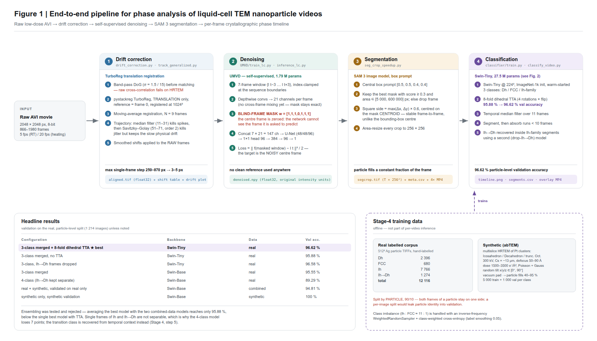

# Liquid-Cell TEM Nanoparticle Pipeline

End-to-end analysis for liquid-cell / in-situ transmission electron microscopy (LC-TEM) videos of metal nanoparticles:

```
raw AVI  →  drift correction  →  denoising  →  segmentation (optional)  →  structure classification
```

Two self-supervised video denoisers are supported — **[UDVD-MF](https://github.com/sreyas-mohan/udvd)** (ICCV 2021; applied to TEM in Science 2025) and **[UMVD](https://github.com/maryaiyetigbo/UMVD)** (CVPRW 2024). **UMVD is the default** (visually cleaner on LC-TEM data): it masks a whole *frame* rather than a spatial blind spot, so it keeps full spatial resolution at the lattice-fringe scale. The pipeline also adds Gatan-DigitalMicrograph-inspired drift correction, SAM 3 segmentation, and a Swin-Transformer nanoparticle-phase classifier (Dh / FCC / Ih).

---

## Paper documentation

Full, paper-ready write-up of the pipeline — every stage, every hyper-parameter, the
datasets, the results tables, and a stage-by-stage citation guide:

| | |
|---|---|
| **[docs/PIPELINE_METHODS.md](docs/PIPELINE_METHODS.md)** | Detailed methods section (drift → denoising → segmentation → classification), results, limitations, and what to cite for each stage |
| **[docs/references.bib](docs/references.bib)** | BibTeX for every citation |
| **[Figure 1](docs/figures/fig1_pipeline.png)** ([SVG](docs/figures/fig1_pipeline.svg)) | The whole pipeline: 4 stages, data shapes, training data, headline results |
| **[Figure 2](docs/figures/fig2_classifier.png)** ([SVG](docs/figures/fig2_classifier.svg)) | The classifier: Swin-Tiny backbone, 8-fold dihedral TTA, temporal post-processing |
| `docs/figures/make_figures.py` | Regenerates both figures (no dependencies; SVG is editable in Inkscape/Illustrator) |



---

## Contents
1. [Install](#install)
2. [Quick start](#quick-start)
3. [Stage 1 — Drift correction](#stage-1--drift-correction)
4. [Stage 2 — Denoising](#stage-2--denoising)
5. [Stage 3 — Segmentation (optional)](#stage-3--segmentation-optional)
6. [Stage 4 — Classification](#stage-4--classification)
7. [Synthetic training data](#synthetic-training-data)
8. [Key results](#key-results)
9. [Repository layout](#repository-layout)

---

## Install

Three conda environments (drift/segmentation, UMVD denoiser, SAM 3):

```bash
# (a) pipeline + drift correction + UDVD-MF
conda env create -n denoise-HDR -f environment.yaml
conda activate denoise-HDR
pip install pystackreg scikit-image opencv-python-headless tifffile

# (b) UMVD denoiser + classifier (torch + timm)
conda create -n umvd python=3.11 -y && conda activate umvd
pip install torch torchvision --index-url https://download.pytorch.org/whl/cu124
pip install timm tifffile scikit-image opencv-python-headless tqdm matplotlib pandas h5py imageio
# synthetic data generation (optional): pip install abtem ase

# (c) SAM 3 segmentation (Python >=3.12)
conda create -n sam3 python=3.12 -y && conda activate sam3
pip install torch torchvision --index-url https://download.pytorch.org/whl/cu124
git clone https://github.com/facebookresearch/sam3 ~/sam3 && cd ~/sam3 && pip install -e .
pip install einops decord pycocotools psutil "numpy<2" tifffile opencv-python-headless scikit-image
```

Conda python paths are hard-coded at the top of `pipeline.py` — edit them if your install differs.

---

## Quick start

**Single isolated particle (auto-detected), full pipeline in one command:**
```bash
python pipeline.py --video /path/to/video.avi
python pipeline.py --video /path/to/video.avi --finetune   # fine-tune UMVD 5 epochs first (better)
```
Outputs land in `/shared/.../test/<video_name>/`: drift-corrected 512² stack, denoised `.npy` + comparison MP4, SAM 3 tight crop, and a `pipeline.log`.

**Large aggregate / whole-field video** (many particles, structure drifts and restructures) — use the whole-field drift tool + UMVD directly (see stages below). `pipeline.py`'s template auto-detect is for a *single* particle and will not work on aggregates.

---

## Stage 1 — Drift correction

There are **two drift tools** — pick by what your video shows:

### A. Single isolated particle → `track_generalized.py`
Bandpass-NCC template tracking. Auto-detects the particle in frame 0 by matching a reference template, tracks it frame-by-frame, skips blurry frames, outputs a 512² crop centered on the particle.
```bash
python track_generalized.py --video in.avi --tcx 885 --tcy 630 \
    --off-x 200 --off-y 250 --template-size 900 --crop-size 512 --out tracked
```
Requires the particle to resemble the reference template. **Fails on samples very different from the reference** (NCC ≈ 0 → random walk).

### B. Whole field / aggregate → `drift_correction.py`  (recommended for in-situ heating series)
Fully automatic pystackreg (TurboReg) alignment of the entire frame — no template, no ROI. Includes the fixes that matter for noisy HRTEM:

```bash
python drift_correction.py --input in.avi --output aligned.tif \
    --reference first --bandpass --proc-res 1024 \
    --moving-average 9 --median-window 11 --smooth-shifts 51
```

| Flag | What it does | Recommended |
|------|--------------|-------------|
| `--bandpass` | register on bandpass-filtered frames (surfaces the lattice; **raw cross-correlation fails on HRTEM**) | **always on** |
| `--reference first` | align every frame to frame 0 (robust; `previous` accumulates error) | `first` |
| `--proc-res 1024` | downscale to N×N for registration (2048² is too slow/heavy otherwise) | `1024` |
| `--moving-average 9` | average N frames before registering — robust to noisy per-frame registration; **halves early-frame shake** on unstable footage | `9` |
| `--median-window` | median pre-filter on the shift trajectory — rejects bad-frame **spikes** (single-frame jumps of 100–800 px) | `11` (clean) / `31` (very noisy) |
| `--smooth-shifts` | Savitzky-Golay smoothing of the shift trajectory — removes residual **jitter** while keeping the real slow drift | `51` / `71` |

**Why these flags exist:** raw pystackreg on HRTEM shakes badly. The two-stage trajectory smoothing (median → savgol) plus moving-average registration takes the max single-frame jump from ~250–870 px down to 3–5 px. Note: genuine fast sample motion (e.g. the first ~20 s of a heating ramp) is *real* and is intentionally preserved.

Outputs: `aligned.tif`, a drift-trajectory plot, and a before/after comparison.

---

## Stage 2 — Denoising (UMVD)

Input is the drift-corrected `.tif` stack. Two options — both live in the `UMVD/` repo (cloned separately).

**(a) Transfer / frozen weights (fast, ~1 min per 1000 frames):**
```bash
python /path/to/UMVD/inference_lc.py \
    --data aligned.tif --weights umvd_ts900/best_model.pth --output denoised.npy
```

**(b) Fine-tune on this video (better, ~30 min) — 5 epochs from the same init:**
```bash
python /path/to/UMVD/train_lc.py \
    --data aligned.tif --output umvd_finetune \
    --init-weights umvd_ts900/best_model.pth \
    --num-epochs 5 --batch-size 8 --image-size 128 --stride 128 --patience 0
```
For large (1024²) whole-field frames use `--stride 128` (fewer, non-overlapping patches) to keep training tractable. `train_lc.py` also writes the final full-frame `denoised.npy`.

> If a fine-tune run diverges (rare) it can save a degenerate all-zero model → black output. Check `denoised.npy` has non-zero content; if black, re-run (it is a training instability, not a data problem).

Make a small side-by-side viewing video (raw | transfer | fine-tune) at 128²:
```bash
python shrink_to_128.py --dir <video_folder> --name <name> --transfer-npy denoised.npy --size 128
```

---

## Stage 3 — Segmentation (optional)

Only needed if you want a tight, particle-filling crop (e.g. before single-particle classification). SAM 3 with a central box prompt.
```bash
python seg_crop_speedup.py --input denoised.npy --output-dir out --name segcrop \
    --min-area 5000 --max-area 600000 --shrink 0.6
```
The prompt is a fixed central box `[0.5, 0.5, 0.4, 0.4]` — great for a single centered particle, but it **wanders on aggregates** (no single persistent object). Raise `--box-size` or switch to a point/text prompt for those.

---

## Stage 4 — Classification

Classifies each particle image into crystallographic phase. Code in `classifier/`.

**Classes:** `Dh` (decahedron), `FCC`, `Ih` (icosahedron). `Ih` and `Ih→Dh` (transition) are **merged** — they are visually inseparable from a single frame, so the 4-class problem is really 3-class.

**Best model + inference (96.6% val accuracy):**
```bash
# classify every frame of a denoised/segmented video, with 8-fold TTA (default)
python classifier/classify_video.py --video segcrop.tif --output-dir out --gpu 0
```
`predict_stack(..., tta=True)` averages 8 dihedral views (4 rotations × flip) per frame. Rotations preserve crystallographic symmetry, so this is principled and adds ~+0.7 pt for free. It produces a per-frame label timeline (with temporal smoothing) + overlay video showing per-class confidences.

**Train a classifier from scratch:**
```bash
python classifier/train.py --arch swin_tiny_patch4_window7_224 \
    --epochs 30 --batch-size 64 --balance sampler+loss --mode merge-ihdh \
    --splits-json splits_particle/splits.json --output runs/swin_merged
```
Key flags: `--mode {4class|merge-ihdh|drop-ihdh}`, `--data {real|synthetic|combined}`, `--init-weights <ckpt>` (warm-start — essential to escape the class-imbalance trivial minimum), `--amp`, `--aug-strength {normal|strong}`.

**Splits are particle-level** (both frames of a particle stay on one side) via `dataset.py build_splits(by_particle=True)` — avoids train/val leakage.

Evaluate + confusion matrix: `classifier/evaluate.py` (or `eval_best_tta.py` for the TTA best config).

---

## Synthetic training data

Real labels are scarce, so you can generate physically-simulated HRTEM images with `abtem`:
```bash
python classifier/generate_synthetic.py --n-train 5000 --n-val 1000 --workers 32
```
Builds `ico` / `deca` / `fcc` nanoparticles (`three_struct_tilt_series.py` has the atomic models), simulates HRTEM with random tilt (x/y/z ∈ 0–90°), defocus, dose, and **random vacuum padding so the particle fills 40–95 % of the frame** (matches how real crops vary). Train with `--data synthetic`, or mix real+synth with `--data combined` (validate on real only).

---

## Key results

| Task | Result | How |
|------|--------|-----|
| Classification (real Ag, particle-level val) | **96.62 %** | Swin-Tiny, 3-class merged, warm-started, **+ 8-fold TTA** |
| — 4-class (with Ih→Dh) | 83 % | the Ih↔Ih→Dh boundary is a genuine single-frame ambiguity |
| Denoising | UMVD > UDVD-MF | transfer ≈ fine-tune ≈ from-scratch on this data |
| Drift (noisy heating video) | max single-frame jump 250–870 px → **3–5 px** | bandpass + median + savgol + moving-average=9 |

Ensembling multiple classifier models was tested and **rejected** (weaker models drag the mean below the single best + TTA).

---

## Repository layout

**Pipeline / drift**
| File | Purpose |
|------|---------|
| `pipeline.py` | one-command runner for a single particle (stages 1→3) |
| `drift_correction.py` | whole-field automatic drift correction (bandpass + smoothing + moving-average) |
| `track_generalized.py` | single-particle bandpass-NCC template tracking |
| `seg_crop_speedup.py` | SAM 3 segmentation + tight crop + 4× speedup |
| `shrink_to_128.py` | build small raw\|transfer\|fine-tune comparison videos |

**Classifier (`classifier/`)**
| File | Purpose |
|------|---------|
| `train.py` | train Swin/ResNet/DINOv2; modes 4class / merge-ihdh / drop-ihdh; data real / synthetic / combined |
| `dataset.py` / `dataset_synthetic.py` / `dataset_combined.py` | particle-level splits + loaders |
| `classify_video.py` | apply classifier to a video with TTA + temporal smoothing → phase timeline |
| `evaluate.py` / `eval_best_tta.py` / `eval_tta_ensemble.py` | val metrics, confusion matrices, TTA/ensemble sweep |
| `generate_synthetic.py` | abtem HRTEM simulation of ico/deca/fcc particles |
| `threshold_sweep.py`, `relabel_ih_to_dh.py`, `test_pad_predict.py` | analysis / ablation helpers |

**Model / util code** is inherited from upstream UDVD-MF (`models/`, `utils/`, `data.py`).

**Documentation (`docs/`)**
| File | Purpose |
|------|---------|
| `PIPELINE_METHODS.md` | full paper-ready methods write-up + results + citation guide |
| `references.bib` | BibTeX for every citation |
| `figures/make_figures.py` | regenerates Figures 1 and 2 as SVG |
| `figures/fig1_pipeline.svg/.png` | Figure 1 — the whole pipeline |
| `figures/fig2_classifier.svg/.png` | Figure 2 — the classifier architecture |

---

## Citations

BibTeX for all of these: **[docs/references.bib](docs/references.bib)**. Which entry belongs
to which stage: **[docs/PIPELINE_METHODS.md §8](docs/PIPELINE_METHODS.md#8-what-to-cite-stage-by-stage)**.

**Denoising stage — cite these**
- **UMVD** (the denoiser actually used): Aiyetigbo, Korte, Anderson, Chalhoub, Kalivas, Luo & Li, "Unsupervised Microscopy Video Denoising," *CVPRW* 2024. [arXiv:2404.12163](https://arxiv.org/abs/2404.12163) · https://github.com/maryaiyetigbo/UMVD
- **UDVD** (baseline; the upstream code base of this repo): Sheth, Mohan, Vincent, Manzorro, Crozier, Khapra, Simoncelli & Fernandez-Granda, "Unsupervised Deep Video Denoising," *ICCV* 2021, pp. 1759–1768. [arXiv:2011.15045](https://arxiv.org/abs/2011.15045)
- **Application precedent**: Crozier, Leibovich, Haluai, Tan, Thomas, Vincent, Mohan, Marcos Morales, Kulkarni, Matteson, Wang & Fernandez-Granda, "Visualizing nanoparticle surface dynamics and instabilities enabled by deep denoising," *Science* **387**(6737), 949–954 (2025). [doi:10.1126/science.ads2688](https://doi.org/10.1126/science.ads2688)
- **Evaluating a denoiser without ground truth**: Marcos Morales et al., "Evaluating Unsupervised Denoising Requires Unsupervised Metrics," *ICML* 2023, PMLR 202, 23937–23957. [arXiv:2210.05553](https://arxiv.org/abs/2210.05553)
- **Theory behind the self-supervision**: Lehtinen et al., *Noise2Noise*, ICML 2018; Krull et al., *Noise2Void*, CVPR 2019; Laine et al., *High-Quality Self-Supervised Deep Image Denoising*, NeurIPS 2019.

**Other stages**
- **Drift correction**: Thévenaz, Ruttimann & Unser, "A Pyramid Approach to Subpixel Registration Based on Intensity," *IEEE TIP* **7**(1), 27–41 (1998) — the TurboReg algorithm behind `pystackreg`; Savitzky & Golay, *Anal. Chem.* **36**, 1627 (1964). The bandpass-then-cross-correlate convention is inspired by Gatan DigitalMicrograph's `ImageAlignment.dll` (not redistributed).
- **SAM 3**: Carion et al., "SAM 3: Segment Anything with Concepts," [arXiv:2511.16719](https://arxiv.org/abs/2511.16719) (2025). https://github.com/facebookresearch/sam3
- **Classifier**: Liu et al., "Swin Transformer," *ICCV* 2021; Wightman, `timm` (2019); Loshchilov & Hutter (AdamW, cosine annealing); Szegedy et al. (label smoothing).
- **Synthetic data**: Madsen & Susi, "The abTEM code: transmission electron microscopy from first principles," *Open Res. Europe* **1**, 24 (2021); Kirkland, *Advanced Computing in Electron Microscopy* (scattering-factor parametrization); Larsen et al., ASE, *J. Phys. Condens. Matter* **29**, 273002 (2017).
